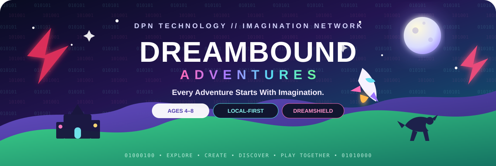
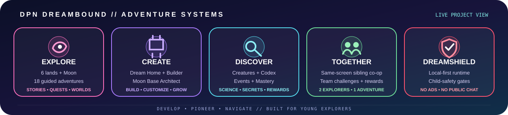

<!-- DREAMBOUND-DPN-HERO:START -->

  
  
  
  

<!-- DREAMBOUND-DPN-HERO:END -->

  <strong>DPN DREAMBOUND // IMAGINATION NETWORK</strong> 
  Every Adventure Starts With Imagination.

  
  
  
  

  
  
  
  

## ✨ What is DreamBound?

**DreamBound Adventures** is DPN Technology's local-first children's adventure game for ages **4–8**. It mixes exploration, imagination, collecting, building, racing, dinosaurs, magic, creative play, light learning, and DreamBuddy friendship in one connected world.

The design goal is simple: **make learning feel like an adventure, not homework**.

> **Child-first baseline:** no ads, no in-app purchases, no analytics, no public chat, no online accounts, no strangers, and no external links presented to children.

## 🌈 Teamplay Development Build — v0.5.1-dev

| System | Current capability |
| --- | --- |
| 🌎 **World** | Six connected regions with Storybook World procedural rendering |
| 🧭 **Adventures** | 14 guided main adventures with objective tracking |
| 🐾 **DreamCreatures** | Six rescueable creatures and a sanctuary |
| 💖 **DreamBuddy** | Companion friendship and interaction system |
| 🏎️ **Racing** | Rainbow Speedway / Ridge Raceway |
| 🦴 **Dinosaurs** | Fossil digging and Dino Egg Memory |
| 🪄 **Magic** | Lessons, unlockable spells, Moonflower Tower |
| 🧱 **Creation** | Builder Mode and persistent Dream Home customization |
| 📸 **Discovery** | Photo Safari, Landmark Hunt, collections and achievements |
| 🛴 **Travel** | Explorer Scooter plus Rainbow Portal fast travel |
| 🧠 **Adaptive play** | Age-scaled Brain Sparks and challenge difficulty |
| 💾 **Profiles** | Three local child profiles with automatic saving |
| 👥 **Sibling Co-op** | Two explorers, two DreamBuddies, shared rewards, DreamLink tether, 3 cooperative gates and 4 team activities |

## 🛡️ DPN DreamShield Security Gates

DreamBound uses a child-focused DPN security model called **DreamShield**.

~~~mermaid
flowchart LR
  PR[Pull Request] --> QG[DPN DreamBound Quality Gate]
  QG --> JS[JavaScript Syntax]
  QG --> SAFE[Child-Safety Runtime Guard]
  QG --> INT[Repository Integrity]
  QG --> SEC[Secret / Dangerous API Guard]
  JS --> GREEN[DreamShield Green Gate]
  SAFE --> GREEN
  INT --> GREEN
  SEC --> GREEN
  PR --> CQL[CodeQL]
  PR --> DEP[Dependency Review]
  GREEN --> MAIN[Protected Main Candidate]
  CQL --> MAIN
  DEP --> MAIN
~~~

### Security layers

- **DPN DreamBound Quality Gate** — source integrity, syntax, child-safety policy and repository checks.
- **Child-Safety Runtime Guard** — rejects remote scripts, external child-facing links, telemetry APIs, WebSockets, dynamic code execution and other unexpected network-capable runtime patterns.
- **CodeQL** — JavaScript/TypeScript static analysis.
- **Dependency Review** — PR supply-chain change analysis.
- **OpenSSF Scorecard** — recurring repository security posture review.
- **Dependabot** — weekly GitHub Actions dependency maintenance.
- **Release Integrity** — tag builds create ZIP + SHA-256 checksum before publishing.
- **Smoke Test** — launches the game through a local HTTP server and verifies the runtime shell is reachable.

Read the full model in [Security Gates](docs/SECURITY_GATES.md) and [Threat Model](docs/THREAT_MODEL.md).

## 🎮 Play locally

### Windows

1. Download or clone the repository.
2. Double-click **PLAY-DREAMBOUND.bat**.
3. DreamBound starts a local web server and opens in the default browser.

If Python is unavailable, the launcher falls back to opening **index.html** directly.

### Controls

| Action | Controls |
| --- | --- |
| Move | WASD / Arrow Keys / Touch D-pad / Gamepad left stick |
| Interact | E / Space / Enter / Sparkle button / Gamepad A |
| Adventure Board | 🧭 |
| DreamBuddy | 💖 |
| Photo Safari | 📸 |
| Explorer Scooter | 🛴 |
| Dream Collection | 🎒 |
| Journal | 📖 |
| Magic Wand | 🪄 |
| Builder Mode | 🧱 |
| Map / Fast Travel | 🗺️ |
| Settings | ⚙️ / Esc |

## 👥 Local sibling co-op

The v0.5 development branch introduces same-screen two-player play. Player 1 hosts the world; Player 2 joins from another saved child profile. Player 2 uses **I/J/K/L + O** or a second gamepad. Both explorers keep their own identity and receive co-op rewards. Three **DreamLink Gates** require both kids to stand on paired pads together.

The system includes a one-screen DreamLink tether to keep younger players together and avoid split-screen complexity in the first co-op milestone.

### Co-op activities now playable

- **DreamLink Team Raceway** — two independently controlled karts with one team score.
- **Team Creature Rescue** — both explorers must high-five before a creature joins both collections.
- **DreamLink Magic Lesson** — alternating Player 1 / Player 2 pattern turns.
- **DreamLink Workshop** — role-based repair challenge with separate Spark Engineer and Gear Engineer jobs.
- **Sibling Stars** — persistent quest tracking unique co-op activities.

## 🗺️ Current lands

**Home Valley → Magic Grove → Racing Ridge → Dino Valley → Builder Bay → Ocean Cove**

Each region has its own visual identity, activities, collectibles and signature landmark.

## 🏡 Dream Home

Players can personalize their Dream Home with persistent furniture and four room themes:

- ☀️ Sunny Sky
- 🌿 Forest Hideout
- 🚀 Star Cabin
- 🐠 Ocean Room

The home also supports Dance Party, Dream Time and DreamBuddy play interactions.

## 💾 Save migration

DreamBound stores progress locally using browser localStorage. Existing WonderWorld v0.1–v0.4 profiles are automatically imported into the DreamBound namespace on first load while the legacy save is left untouched as a fallback.

## 🔐 Child-safety architecture

DreamBound intentionally has a narrow runtime trust boundary:

~~~text
Child Input
   │
   ▼
Local Browser Game
   │
   ├── Local Canvas / Audio / UI
   ├── Local Profile Save (localStorage)
   └── Local HTTP launcher
        │
        └── No required cloud account, analytics or public multiplayer
~~~

Any future feature that expands this boundary—cloud saves, online co-op, accounts, telemetry, external content, AI, voice, chat or user-generated sharing—must receive an explicit security/privacy design review before merge.

## 🧪 Local validation

~~~bash
node --check game.js
python3 tools/validate_dreambound.py --mode all
~~~

The validator checks project structure, child-safety invariants, dangerous browser APIs, unexpected external URLs, conflict markers, required policy files and repository metadata.

## 📚 Engineering documents

| Document | Purpose |
| --- | --- |
| [Security Policy](SECURITY.md) | Responsible disclosure and supported security reports |
| [Contributing](CONTRIBUTING.md) | Contribution and development rules |
| [Security Gates](docs/SECURITY_GATES.md) | CI/CD controls and expected merge gates |
| [Threat Model](docs/THREAT_MODEL.md) | Child-safety and local-runtime trust boundaries |
| [Brand Transition](BRAND-TRANSITION.md) | WonderWorld → DreamBound compatibility notes |
| [Verification](VERIFICATION.md) | v0.4.1 verification record |
| [Changelog](CHANGELOG.md) | Version history |
| [Release Process](docs/RELEASE_PROCESS.md) | Validated packaging and release rules |
| [Third-Party Licenses](THIRD_PARTY_LICENSES.md) | Runtime and CI dependency/license ledger |

## 🚀 Roadmap direction

The next major development phase is expected to focus on richer animated assets, deeper avatars, enterable interiors, creature habitats, additional vehicles, Space Center / Moon exploration, underwater submarine gameplay, cinematic story chapters and local sibling co-op.

These are roadmap directions—not claims of features already shipped.

## 🧩 DPN Technology

DreamBound is part of the broader **DPN Technology** ecosystem.

**DEVELOP. PIONEER. NAVIGATE.**

> Repository presentation rule: visuals, security badges and feature claims must remain tied to real repository evidence. DreamBound should look magical for kids without overstating what the build actually does.
