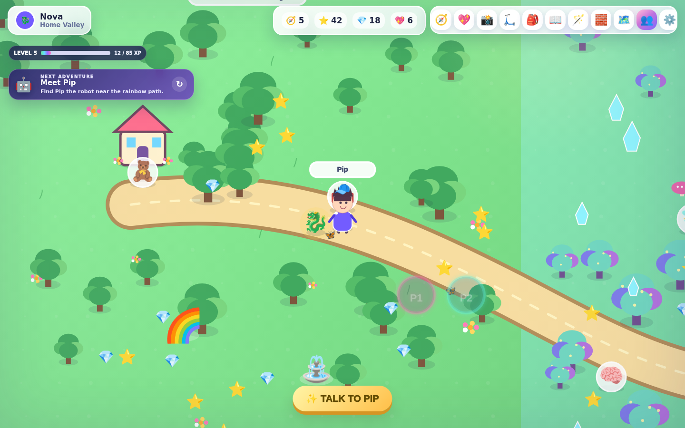
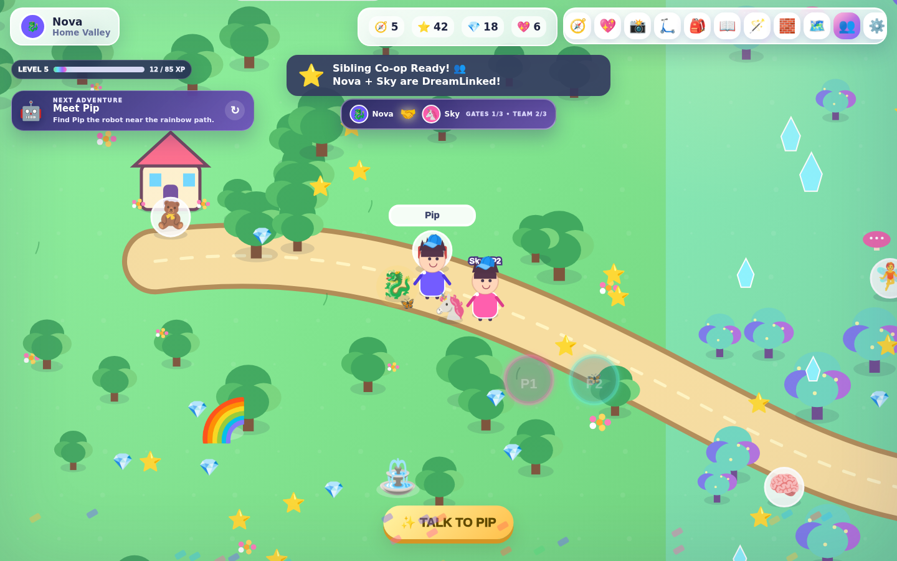
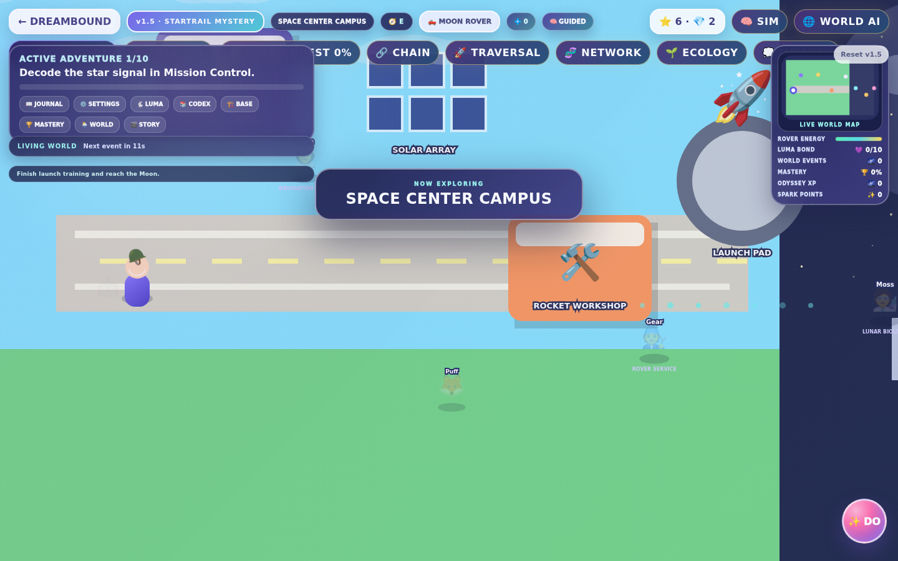
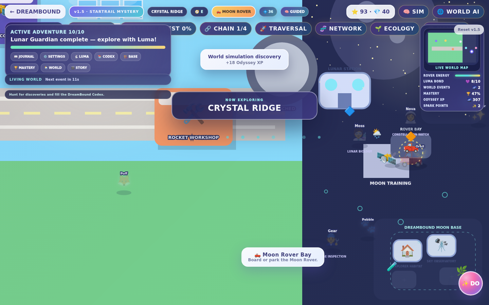
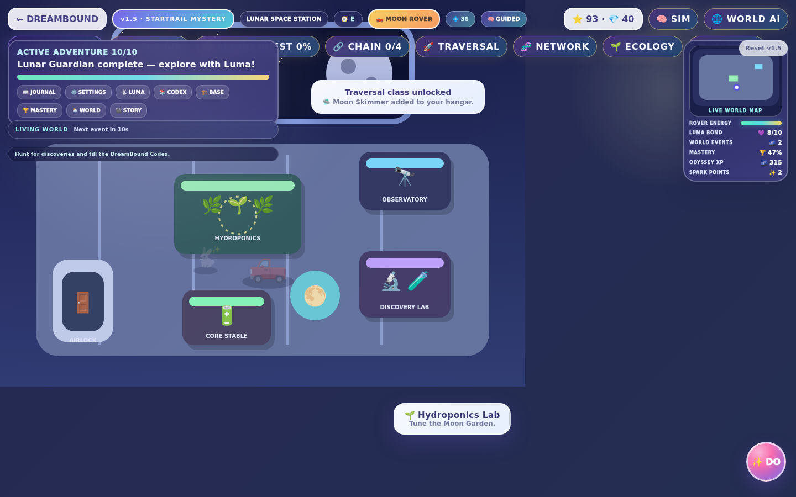
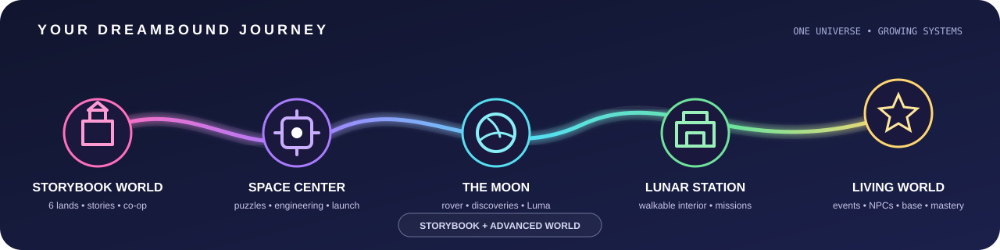

  

  <strong>DPN DREAMBOUND // IMAGINATION NETWORK</strong> 
  <em>Every Adventure Starts With Imagination.</em>

  <a href="#-play-dreambound"><strong>🎮 Play</strong></a>
  ·
  <a href="#-choose-your-adventure"><strong>🌈 Explore the Game</strong></a>
  ·
  <a href="#-dreamshield--child-first-by-design"><strong>🛡️ Child Safety</strong></a>
  ·
  <a href="#-for-developers--testers"><strong>🧪 Build & Test</strong></a>
  ·
  <a href="#-project-roadmap"><strong>🚀 Roadmap</strong></a>

  
  
  
  
  

  
  
  
  

---

## 🌟 DreamBound at a glance

**DreamBound Adventures** is a local-first children's adventure game from **DPN Technology**, designed for young explorers ages **4–8**. It combines story-driven exploration, puzzles, building, racing, dinosaurs, magic, discovery, creative play, light learning, companion friendship, and same-screen sibling co-op inside one growing universe.

The goal is simple: **make discovery feel like an adventure instead of homework.**

| For kids | For families | For testers & developers |
| --- | --- | --- |
| Explore magical lands, the Space Center, and the Moon | Local-first play with no required child account | Modular JavaScript runtime plus a legacy Storybook runtime |
| Rescue DreamCreatures and befriend Luma | No ads, in-app purchases, analytics, or public chat | DreamShield validation, CodeQL, supply-chain gates, smoke tests |
| Build, race, discover, solve, customize, and play together | Three local child profiles and automatic saving | Sanitized local state, loopback-only server, release integrity checks |
| Choose guided or more independent challenges | Accessibility controls and age-scaled activities | Architecture, threat model, release, and security documentation |

> **Child-first baseline:** no ads, no in-app purchases, no analytics, no public chat, no required online accounts, no strangers, and no external child-facing links in the game runtime.

  

## 📸 Real gameplay gallery

> **Verified runtime evidence:** every image below is captured automatically from the real DreamBound build on `main` using the loopback-only local server and the repository's visual-evidence workflow. These are **not mockups**.

| 📖 Storybook World | 👥 Sibling Co-op |
| --- | --- |
|  |  |
| **Home Valley exploration** — live HUD, objectives, DreamBuddy, collectibles, NPC interaction, and the current Storybook renderer. | **DreamLinked explorers** — two local child profiles sharing one world with co-op status, team progress, and separate characters. |

| 🚀 Advanced World — Space Center | 🌙 Moon Rover + Luma |
| --- | --- |
|  |  |
| **Space Center Campus** — the modular vNext runtime with Adventure Director, live world map, simulation systems, missions, and engineering locations. | **Living Moon systems** — Moon Rover, Luma bond, Moon Base progress, Codex resources, mastery, NPCs, and lunar exploration. |

  

  <strong>🏢 Walkable Lunar Space Station</strong> 
  Hydroponics • Observatory • Discovery Lab • Power Core • Airlock • live Advanced World telemetry

<strong>🔎 How these screenshots are verified</strong>

The repository runs `tools/capture_readme_screenshots.mjs` in GitHub Actions against `serve_dreambound.py`. The workflow creates known local-only test profiles/state, launches the actual Storybook and Advanced World runtimes, validates every PNG, uploads the evidence artifact, and publishes all five screenshots back to the repository.

That means the gallery can be regenerated from source instead of relying on manually edited promotional images.

## 🎮 Play DreamBound

### Windows — fastest path

1. **Download or clone** this repository.
2. Double-click **<code>PLAY-DREAMBOUND.bat</code>**.
3. DreamBound starts its secure loopback-only local server and opens in your browser.
4. Choose a local profile and start exploring.

If Python is unavailable, the Windows launcher falls back to opening <code>index.html</code> directly.

### Which mode should I choose?

| Mode | Best for | What it includes |
| --- | --- | --- |
| 📖 **Storybook World** | The widest collection of family activities | Six lands, guided adventures, DreamCreatures, racing, dinosaurs, magic, building, interiors, discovery systems, and sibling co-op |
| 🚀 **Advanced World** | The newest modular engine experience | Space Center, Moon exploration, Lunar Station, Moon Rover, Luma, quests, dynamic events, NPC friendships, Moon Base Architect, Codex, and Mastery |
| 👥 **Sibling Co-op** | Two kids playing together on one screen | Two explorers, two DreamBuddies, team activities, shared rewards, DreamLink gates, and cooperative challenges |

On the title screen, choose the **Living World / Advanced World** launch option to enter the modular engine.

## 🌈 Choose your adventure

  

### 📖 Storybook World

Travel through:

**Home Valley → Magic Grove → Racing Ridge → Dino Valley → Builder Bay → Ocean Cove**

Current Storybook systems include:

| System | What young explorers can do |
| --- | --- |
| 🧭 **Adventures** | Follow **18 guided main adventures** with objective tracking |
| 🌟 **Connected stories** | Play **The Sleeping Star** and **The Lost Explorer Map** |
| 🐾 **DreamCreatures** | Rescue six creatures and visit the sanctuary |
| 💖 **DreamBuddy** | Build friendship through interactions and shared activities |
| 🏎️ **Racing** | Race at Rainbow Speedway / Ridge Raceway |
| 🦴 **Dinosaurs** | Dig fossils and play Dino Egg Memory |
| 🪄 **Magic** | Learn spells, explore Moonflower Tower, and solve the Star Chamber |
| 🧱 **Creation** | Use Builder Mode and personalize a persistent Dream Home |
| 🎨 **Avatar Studio** | Save hairstyles and playful accessories to each profile |
| 📸 **Discovery** | Photo Safari, Landmark Hunt, collections, stickers, and achievements |
| 🛴 **Travel** | Use the Explorer Scooter and Rainbow Portal fast travel |
| 🧠 **Adaptive play** | Age-scaled Brain Sparks and challenge difficulty |
| 💾 **Profiles** | Maintain three local child profiles with automatic saving |
| 👥 **Sibling co-op** | Play same-screen with two explorers and cooperative activities |

### 🚀 Advanced World

The newer modular engine begins at the **Space Center**, expands onto the **Moon**, and continues into a persistent living lunar adventure.

**Current Advanced World highlights**

- 🛰️ **Space Center campus** — Mission Control, Solar Array, Rocket Workshop, and Launch Pad.
- 🌙 **Moon exploration** — route navigation, discoveries, Moon rocks, region guidance, and ambient world polish.
- 🏢 **Lunar Space Station** — a real walkable interior with Hydroponics, Observatory, Discovery Lab, Power Core, and Airlock.
- 🚙 **Moon Rover** — acceleration, friction, boost, energy drain/recharge, dust trails, and optional controller rumble.
- 💫 **Luma** — rescue a stranded lunar creature and grow a persistent companion bond.
- 📖 **Mission Journal** — data-driven quests, progression milestones, and rewards.
- 🌌 **Living World events** — Meteor Shower, Crystal Bloom, Aurora Wave, and Luma Star Parade rotations.
- 🧑‍🚀 **Explorer NPCs** — Nova, Gear, and Moss move on schedules with changing dialogue and persistent friendship.
- 🏗️ **Moon Base Architect** — build permanent Habitat, Observatory, Rover Garage, and Moon Greenhouse modules.
- 🔭 **Discovery Codex** — tracks discoveries, rare events, Luma, engineering finds, base progress, and friendships.
- 🧠 **Adventure Director** — adapts pacing and recommendations across Guided, Curious, Brave, and Master tiers.
- 🏆 **Explorer Mastery** — long-term achievements across exploration, science, quests, friendships, base building, and travel.

## 👥 Local sibling co-op

DreamBound supports same-screen two-player play. Player 1 hosts the world while Player 2 joins from another local child profile.

- **Player 1:** WASD / Arrow Keys / first gamepad
- **Player 2:** I / J / K / L + O / second gamepad
- **DreamLink tether:** keeps younger explorers together without split-screen complexity
- **Team activities:** Team Raceway, Team Creature Rescue, DreamLink Magic Lesson, DreamLink Workshop, and Sibling Stars
- **Shared progress:** cooperative rewards are applied while each explorer keeps their identity

## 🎛️ Controls

| Action | Controls |
| --- | --- |
| Move | WASD / Arrow Keys / Touch D-pad / Gamepad left stick |
| Interact | E / Space / Enter / Sparkle button / Gamepad A |
| Boost / Rover | Shift / gamepad trigger |
| Adventure Board | 🧭 |
| DreamBuddy | 💖 |
| Photo Safari | 📸 |
| Explorer Scooter | 🛴 |
| Dream Collection | 🎒 |
| Journal | 📖 |
| Magic Wand | 🪄 |
| Builder Mode | 🧱 |
| Map / Fast Travel | 🗺️ |
| Settings | ⚙️ / Esc |

## 🧒 Built for younger explorers

DreamBound is intentionally designed around a young audience rather than simply shrinking a general-purpose game UI.

- **Readable interaction prompts** and icon-led actions
- **Gentle retries** instead of harsh failure loops
- **Age-scaled challenges** for younger and older players in the 4–8 range
- **Reduced motion**, **high contrast**, **large UI**, and audio controls
- **Local progress** that does not require a child account
- **One-screen co-op** that helps siblings stay together
- **No public social layer** inside the child runtime

## 🛡️ DreamShield — child-first by design

DreamBound uses **DreamShield**, DPN Technology's child-focused repository and runtime security model.

~~~mermaid
flowchart LR
  A[Code Change] --> B[DreamShield Quality Gate]
  B --> C[Syntax + Runtime Contracts]
  B --> D[Child-Safety Guard]
  B --> E[Repository Integrity]
  B --> F[Save-State Fuzzing]
  A --> G[CodeQL]
  A --> H[Supply-Chain Review]
  C --> I[Green Candidate]
  D --> I
  E --> I
  F --> I
  G --> I
  H --> I
  I --> J[Smoke + Release Validation]
~~~

### Runtime trust boundary

~~~text
Young Explorer
      │
      ▼
Local DreamBound Runtime
      │
      ├── Canvas / UI / procedural audio
      ├── Sanitized local profile + progress
      └── Loopback-only local server
                │
                └── No required cloud account, analytics,
                    ads, public chat, or remote child runtime
~~~

Persistent profiles and vNext state are treated as **untrusted input**. DreamBound bounds and sanitizes stored values before use, quarantines malformed saves, and fuzz-tests state handling with thousands of randomized hostile inputs.

<strong>🔐 DreamShield security layers</strong>

- **DPN DreamBound Quality Gate** — repository integrity, syntax, policy, and runtime contracts.
- **Child-Safety Runtime Guard** — rejects unexpected network-capable APIs, remote scripts, external child-facing links, dynamic code execution, and other disallowed runtime patterns.
- **CodeQL** — JavaScript/TypeScript static analysis.
- **Dependency Review / Supply Chain** — reviews dependency changes and GitHub Actions supply-chain posture.
- **OpenSSF Scorecard** — recurring repository security posture checks.
- **Dependabot** — scheduled GitHub Actions dependency maintenance.
- **Save-state fuzzing** — randomized malformed input testing across profile and modular state surfaces.
- **Loopback smoke tests** — verifies the secure local server and runtime shell.
- **Release integrity** — validated release packaging plus checksums/provenance controls.

See [Security Gates](docs/SECURITY_GATES.md), [Threat Model](docs/THREAT_MODEL.md), and [Security Policy](SECURITY.md).

## 🏗️ Two runtimes, one DreamBound universe

DreamBound is in an intentional migration phase:

~~~text
STORYBOOK WORLD
legacy game.js
  │
  │  mature content library
  │  six lands + co-op + activities
  │
  ▼
progressive feature migration
  │
  ▼
ADVANCED WORLD
src/vnext/
  ├── bounded state + storage
  ├── input + controller support
  ├── Space Center + Moon world
  ├── Lunar Guardian
  ├── FX + procedural audio
  ├── vehicles + scenes
  ├── quests + companion AI
  └── Living World / Director systems
~~~

The Storybook World remains playable while mature systems are progressively migrated into the modular engine. New vNext gameplay belongs in modules rather than expanding the original monolithic runtime.

## 🧪 For developers & testers

### Quick validation

~~~bash
node --check game.js
python3 tools/validate_dreambound.py --mode all
~~~

DreamShield also validates modular JavaScript recursively, runtime security contracts, child-safety rules, save handling, workflow integrity, and release packaging.

### Engineering principles

1. **Local-first child runtime** — no cloud dependency is required to play.
2. **One authoritative owner per system** — avoid duplicate implementations across modules.
3. **Stored state is untrusted** — validate and bound it before use.
4. **New Advanced World gameplay is modular** — avoid growing the legacy monolith.
5. **Security gates are product requirements** — not optional cleanup after development.
6. **Repository claims must match real code** — no fake screenshots, features, or release claims.

<strong>📚 Engineering & project documents</strong>

| Document | Purpose |
| --- | --- |
| [vNext Architecture](docs/VNEXT_ARCHITECTURE.md) | Advanced World module ownership and migration model |
| [Security Policy](SECURITY.md) | Responsible disclosure and supported reports |
| [Security Gates](docs/SECURITY_GATES.md) | CI/CD controls and merge expectations |
| [Threat Model](docs/THREAT_MODEL.md) | Child-safety and runtime trust boundaries |
| [Contributing](CONTRIBUTING.md) | Contribution and development rules |
| [Release Process](docs/RELEASE_PROCESS.md) | Validated packaging and release rules |
| [Third-Party Licenses](THIRD_PARTY_LICENSES.md) | Runtime and CI dependency/license ledger |
| [Changelog](CHANGELOG.md) | Development history |
| [Brand Transition](BRAND-TRANSITION.md) | WonderWorld → DreamBound compatibility notes |
| [Verification](VERIFICATION.md) | Historical verification record |

## 💾 Save compatibility

DreamBound stores progress locally using browser storage. Existing WonderWorld v0.1–v0.4 profiles are imported into the DreamBound namespace on first load while the legacy save is left untouched as a fallback.

Current modular state includes progression, Space Center and Lunar Guardian milestones, Moon discoveries, rover/Luma state, quests, badges, resources, Moon Base modules, world-event history, NPC friendship, Codex entries, and Mastery progress.

## 🚀 Project roadmap

DreamBound's next major engineering direction is focused on **depth and convergence**, not creating a second disconnected game.

- Migrate mature Storybook systems into the modular Advanced World architecture.
- Reduce and eventually remove the legacy DOM compatibility bridge.
- Expand richer animated art, world feedback, and character presentation without introducing remote runtime dependencies.
- Deepen avatars, interiors, creature habitats, vehicles, and cinematic story chapters.
- Extend the shared vehicle/scene/quest contracts instead of creating one-off gameplay loops.
- Continue expanding age-friendly accessibility, sibling co-op, and persistent discovery systems.
- Keep every new system inside DreamShield's child-safety, security, and release gates.

Roadmap items are **directional** until they are implemented and verified in the repository.

---

  <strong>DPN TECHNOLOGY // DREAMBOUND ADVENTURES</strong> 
  DEVELOP. PIONEER. NAVIGATE.  
  <em>Build worlds worth exploring. Build them safely.</em>

